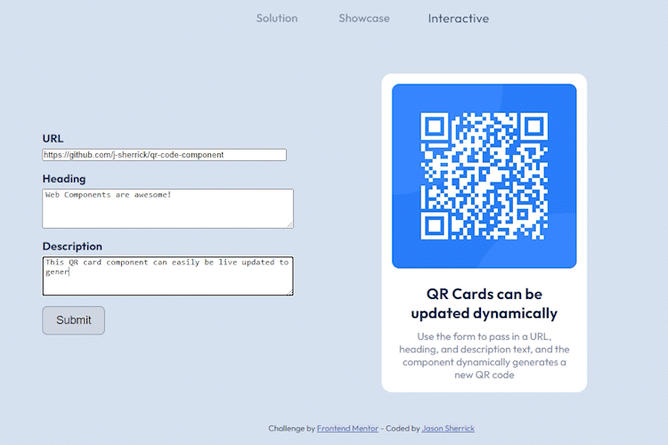

# QR Card component
The QR Card component is a reusable, fully self-contained Web Component for dynamically generating and displaying QR codes along with related information within your web applications.

This is a solution to the [QR code component challenge on Frontend Mentor](https://www.frontendmentor.io/challenges/qr-code-component-iux_sIO_H).

## Table of contents

  - [Overview](#overview)
  - [Links](#links)
  - [Usage](#usage)
    - [Attributes](#attributes)
      - [`url`](#url)
      - [`slot["heading"]`](#slotheading)
      - [`slot["description"]`](#slotdescription)
  - [Screenshots](#screenshots)
  - [Built with](#built-with)
  - [What I learned](#what-i-learned)
    - [Skills](#skills)
    - [Controlled Form](#controlled-form)
      - [HTML](#html)
      - [JavaScript](#javascript)
  - [Continued Development](#continued-development)
  - [Useful Resources](#useful-resources)
  - [Author](#author)

## Overview

The `qr-card` custom element encapsulates a visual card containing a QR code. The QR code is dynamically generated using the `node-qrcode` npm package, which has been bundled with the component using Browserify. This means the component is fully self-contained and will work 'out of the box' with only a single `<script>` tag in your HTML.

The QR code is generated based on the URL attribute provided to the component, and descriptive text is provided via the use of named slots.

## Links

- Solution URL: [Web Component Source](https://github.com/j-sherrick/qr-code-component/blob/main/components/QRCard-nobundle.js)
- Live Site URL: [Solution Landing Page](https://j-sherrick.github.io/qr-code-component/index.html)

## Usage

Download `QRCard.js` from the `components` folder and include it in a `<script>` tag anywhere in your HTML. Set the `defer` attribute so the script does not execute until after the page is finished loading. The component is fully self-contained, so no other external JavaScript is required.

Now you can include the `<qr-code>` element anywhere in your HTML:

```html
<qr-card url="https://www.frontendmentor.io/">
   <h2 slot="heading">Improve your front-end skills by building projects</h2>
   <p slot="caption">Scan the QR code to visit Frontend Mentor and take your coding skills to the next level</p>
</qr-card>
```


### Attributes

#### `url`

URL to encode as a QR code. There are currently no checks to enforce any specific URL pattern(s), so technically this can be any string up to 2048 characters.

#### `slot["heading"]`

The main heading. This should be an `<h2>` element as this is what the component is expecting and styled for. No character limit is enforced.

#### `slot["description"]`

The subheading or description. This should be a `<p>` element as this is what the component is expecting and styled for. No character limit is enforced.

## Screenshots
Add as many `<qr-code>` elements to the page as your tender heart desires:


Using lifecycle callbacks we can watch the `url` attribute for changes, and have the same component generate a new QR code any time it's updated:




## Built with

- [Web Components](https://developer.mozilla.org/en-US/docs/Web/API/Web_components) - Web Component API
- [node-qrcode](https://www.npmjs.com/package/qrcode/) - QR code generator
- [Browserify](https://browserify.org/) - Dependency bundler
- [Flexbox](https://developer.mozilla.org/en-US/docs/Learn/CSS/CSS_layout/Flexbox) - Fluid layout
- [Semantic HTML](https://developer.mozilla.org/en-US/docs/Glossary/Semantics)
- [Dev Tools](https://developer.chrome.com/docs/devtools/) - Debugging
- [ChatGPT](https://chat.openai.com/) - Debugging

## What I learned

### Skills
- Web Components API
- Web Component lifecycle callbacks
- Building a customization API via Web Component attributes
- Working with the shadow DOM
- Fluid layouts with Flexbox
- Writing better README files

The [JavaScript driven, interactive component](https://j-sherrick.github.io/qr-code-component/interactive.html) was fun to make!

### JavaScript-driven Interactivity
#### HTML
```html
<form class="qr-update">
    <div class="url">
        <label for="url">URL</label>
        <input 
            type="text"
            name="url"
            id="url" 
            maxlength="100"
            size="50"
            placeholder="Enter a URL to encode"
        />
    </div>
    <div class="heading">
        <label for="heading">Heading</label>
        <textarea 
            name="heading"
            id="heading" 
            maxlength="100"
            placeholder="Enter your main heading here"
            rows="4"
            cols="50"
        ></textarea>
    </div>
    <div class="description">
        <label for="description">Description</label>
        <textarea 
            name="description"
            id="description" 
            maxlength="250"
            placeholder="A descriptive caption or subheading goes here"
            rows="4"
            cols="50"
         ></textarea>
    </div>
    <button id="submit">Submit</button>
</form>

<qr-card url="Update the QR Card with the form on this page!">
   <h2 slot="heading">QR Cards can be updated dynamically</h2>
   <p slot="caption">Use the form to pass in a URL, heading, and description text, and the component dynamically generates a new QR code</p>
</qr-card>
```
#### JavaScript
```js
const urlInput = document.getElementById('url');
const headInput = document.getElementById('heading');
const descInput = document.getElementById('description');
function resetForm() {
    urlInput.value = '';
    headInput.value = '';
    descInput.value = '';
}
function updateCard() {
    const qrCard = document.querySelector('qr-card');
    const qrHead = qrCard.querySelector('h2');
    const qrDesc = qrCard.querySelector('p');
    qrCard.setAttribute('url', urlInput.value);
    qrHead.innerText = headInput.value;
    qrDesc.innerText = descInput.value;
}
function submit(e) {
    e.preventDefault();
    updateCard();
    resetForm();
}
document.querySelector('button').addEventListener('click', submit);
```

## Continued Development

Some ideas for continued development:
  - Enforce `url` attribute has valid url format(s)
  - Unit tests
  - Functional tests
  - Build on the customization API
    - Scaling
    - Choose vertical or horizontal layout
    - Toggle drop shadow
    - QR code background color
    - QR code color
  - Enforce slot element type
    - As of right now it is up to the consumer of the compoent to slot the 'correct' HTML elements. The card expects an `<h2` and a `<p>`, respectively. Using an `<h1>` instead of `<h2>` for example, will break the card.
      - One idea to fix this is to utilize the customization API and use attributes for the description text instead of slots
## Useful Resources

- [Web Components](https://developer.mozilla.org/en-US/docs/Web/API/Web_components) - 
  Web Components API reference

- [Lifecycle Callbacks](https://developer.mozilla.org/en-US/docs/Web/API/Web_components/Using_custom_elements) - 
  Lifecycle callbacks allow for dynamic and context-aware components

- [Context-Aware Web Components](https://css-tricks.com/context-aware-web-components/) - More examples of lifecycle callbacks

- [Learn Web Components in 25 Minutes](https://www.youtube.com/watch?v=2I7uX8m0Ta0) -  Practical example of using Web Components API

- [Writing a Good README](https://www.freecodecamp.org/news/how-to-write-a-good-readme-file/) - The value of writing good README files cannot be overstated

## Author

- LinkedIn - [Jason Sherrick](https://www.linkedin.com/in/jsherrick/)
- Frontend Mentor - [@j-sherrick](https://www.frontendmentor.io/profile/j-sherrick)
- GitHub - [j-sherrick](https://github.com/j-sherrick)